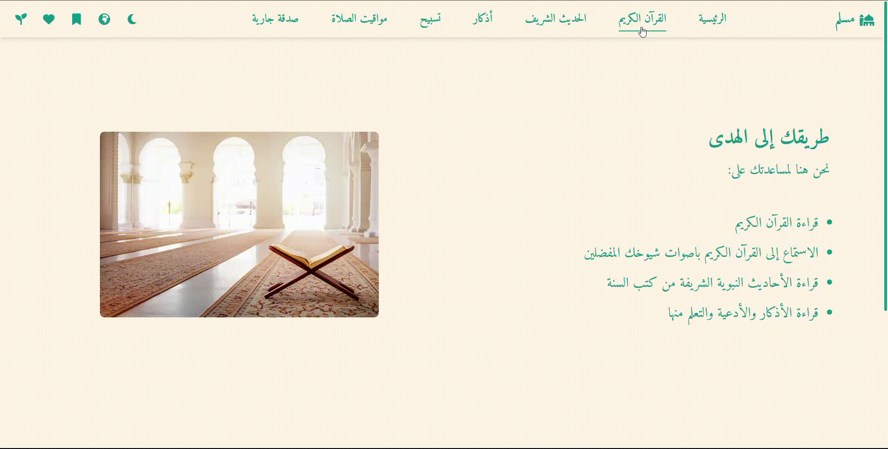
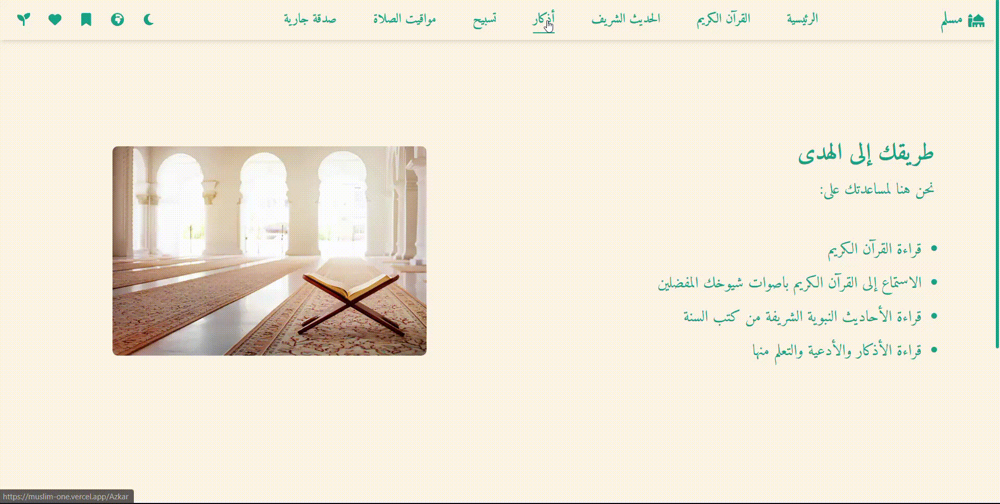
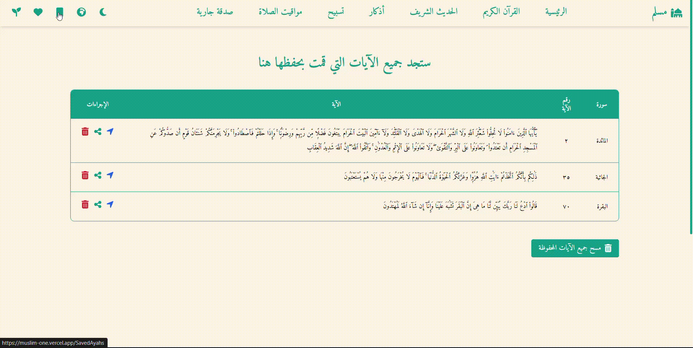
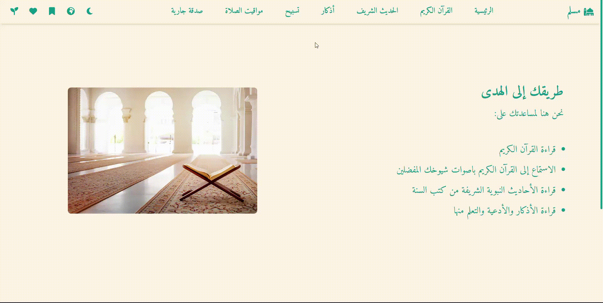

<div align="center">

# 🌙 Muslim Website

### *Your Path to Islamic Knowledge and Spiritual Growth*

[](https://muslim-one.vercel.app/)
[](https://nextjs.org/)
[](https://www.typescriptlang.org/)
[](LICENSE)

**A continuous charity (Sadaqah Jariyah) progressive web application designed to help Muslims around the world connect with their faith through comprehensive Islamic resources.**

[🌐 Live Demo](https://muslim-one.vercel.app/) • [📝 Report Bug](https://github.com/karreemm/Muslim/issues) • [✨ Request Feature](https://github.com/karreemm/Muslim/issues)

</div>

---

## 📖 About The Project

Muslim Website is a comprehensive Islamic resource platform that brings together the Holy Quran, authentic Hadiths, daily Azkar, and essential Islamic tools in one beautifully designed, user-friendly interface. Built as a Sadaqah Jariyah (continuous charity), this project aims to make Islamic knowledge accessible to everyone, anywhere, at any time.

### 🎯 Key Highlights

- 🌍 **Fully Responsive** - Works seamlessly on desktop, tablet, and mobile devices
- 🌓 **Dark Mode Support** - Easy on the eyes for day and night reading
- 🌐 **Bilingual Interface** - Full support for Arabic and English languages
- 📱 **Progressive Web App (PWA)** - Install on your device for offline access
- 🎨 **Beautiful UI/UX** - Clean, modern design focused on readability and usability
- 💾 **Local Storage** - Save your progress and favorites across sessions

---

## ✨ Features

### 📖 Read the Holy Quran


- Browse by **Surah** or **Juz** for flexible navigation
- Beautiful Arabic typography optimized for Quranic text
- **Save Ayahs** to continue reading later
- **Bookmark favorite Surahs** for quick access
- Smooth scrolling and intuitive interface

### 🎧 Listen to the Holy Quran


- Choose from **14 world-renowned reciters** including:
  - Abdullah Basfar, Abdurrahman Al-Sudais, Mishary Alafasy
  - Maher Al Muaiqly, Muhammad Jibreel, and more
- High-quality audio streaming
- Browse by reciter or Surah
- Seamless playback controls

### 📜 Read Authentic Hadiths


- Access **8 authentic Hadith collections**:
  - Sahih Muslim, Sahih Bukhari, Sunan Abu Dawud
  - Sunan al-Tirmidhi, Sunan an-Nasa'i, Sunan Ibn Majah
  - Muwatta Malik, Musnad Ahmad
- Over **7,000+ hadiths** available
- Save and bookmark favorite hadiths
- Easy search and navigation

### 🕋 Daily Azkar & Duas


- **8 comprehensive categories** of Azkar:
  - 🌅 Morning Azkar (25 duas)
  - 🌙 Evening Azkar (25 duas)
  - 🤲 Post-Salah Azkar (9 duas)
  - 📿 Tasbeeh (16 phrases)
  - 😴 Sleep Azkar (10 duas)
  - ⏰ Wake Up Azkar (3 duas)
  - 📖 Quranic Duas (26 duas)
  - 🕌 Prophets' Duas (13 duas)
- **127+ total duas and azkar**
- Arabic text with transliteration and translation
- Save your favorite azkar

### ⭐ Favorites & Saved Items


- Save Quranic verses for later reading
- Bookmark your favorite Surahs
- Mark favorite Hadiths
- Save preferred Azkar
- All data stored locally on your device

### 🕌 Prayer Times


- **Location-based accurate prayer times**
- Shows all 5 daily prayers (Fajr, Dhuhr, Asr, Maghrib, Isha)
- Countdown to next prayer
- Support for multiple calculation methods
- Automatic location detection

### 💖 Sadaqa Jariya


- Dedicate Quran reading for **deceased loved ones**
- Create personalized memorial pages
- Share good deeds in memory of the departed
- Track your spiritual contributions
- Beautiful, respectful interface

### 📿 Tasbeeh Counter


- **Digital dhikr counter** for daily remembrance
- Tap or click to count
- Set goals and track progress
- Multiple counter support
- Persistent state across sessions

---

## 📊 Statistics

<div align="center">

| Resource | Count |
|----------|-------|
| 📖 Quran Surahs | 114 Surahs |
| 📜 Total Hadiths | 7,000+ Hadiths |
| 🕋 Azkar & Duas | 127+ Azkar |
| 🎧 Reciters | 14 Reciters |
| 📚 Hadith Books | 8 Collections |
| 🗂️ Azkar Categories | 8 Categories |

</div>

---

## 🛠️ Tech Stack

### Frontend Framework
- **[Next.js 14.2](https://nextjs.org/)** - React framework with App Router
- **[React 18](https://react.dev/)** - UI library
- **[TypeScript](https://www.typescriptlang.org/)** - Type-safe development

### Styling
- **[Tailwind CSS 4.1](https://tailwindcss.com/)** - Utility-first CSS framework
- **[PostCSS](https://postcss.org/)** - CSS transformation

### UI Components & Icons
- **[Font Awesome](https://fontawesome.com/)** - Icon library
- **[Lucide React](https://lucide.dev/)** - Icon components
- **[Headless UI](https://headlessui.com/)** - Unstyled UI components

### State Management & Utilities
- **[React Context API](https://react.dev/reference/react/createContext)** - Global state management
- **[Axios](https://axios-http.com/)** - HTTP client
- **[Moment Hijri](https://www.npmjs.com/package/moment-hijri)** - Islamic calendar support

### APIs & Data Sources
- **[Quran.com API](https://quran.com/)** - Quran text and audio
- **[Aladhan API](https://aladhan.com/prayer-times-api)** - Prayer times
- **[Sunnah.com API](https://sunnah.com/)** - Hadith collections

---

## 🚀 Getting Started

### Prerequisites

- Node.js 18.0 or higher
- npm or yarn package manager

### Installation

1. **Clone the repository**
   ```bash
   git clone https://github.com/karreemm/Muslim.git
   cd Muslim
   ```

2. **Install dependencies**
   ```bash
   npm install
   # or
   yarn install
   ```

3. **Run the development server**
   ```bash
   npm run dev
   # or
   yarn dev
   ```

4. **Open in browser**
   
   Navigate to [http://localhost:3000](http://localhost:3000)

### Build for Production

```bash
npm run build
npm start
```

---

## 📱 Installing as PWA

The Muslim website can be installed on your device as a Progressive Web App for quick access and offline functionality.

### On Mobile (Android/iOS)

1. Open the website in your mobile browser
2. Tap the **menu icon** (⋮ or ⋯)
3. Select **"Add to Home Screen"**
4. Choose a name and tap **"Add"**

### On Desktop (Chrome/Edge)

1. Open the website in Chrome or Edge
2. Click the **install icon** (⊕) in the address bar
3. Click **"Install"** in the popup

---

## 🤝 Contributing

Contributions are what make the open-source community such an amazing place to learn, inspire, and create. Any contributions you make are **greatly appreciated** as this is a Sadaqah Jariyah project.

### How to Contribute

1. Fork the Project
2. Create your Feature Branch (`git checkout -b feature/AmazingFeature`)
3. Commit your Changes (`git commit -m 'Add some AmazingFeature'`)
4. Push to the Branch (`git push origin feature/AmazingFeature`)
5. Open a Pull Request

### Areas for Contribution

- 🐛 Bug fixes
- ✨ New features
- 📝 Documentation improvements
- 🌍 Translations
- 🎨 UI/UX enhancements
- ⚡ Performance optimizations

---

## 📄 License

This project is open source and available under the [MIT License](LICENSE).

---

## 🙏 Acknowledgments

- **Allah (SWT)** for the opportunity to serve the Muslim community
- **Quran.com** for providing Quran text and audio APIs
- **Sunnah.com** for authentic Hadith collections
- **Aladhan** for prayer times calculation
- All the **reciters** whose beautiful recitations are featured
- The **open-source community** for amazing tools and libraries

---

## 📞 Contact & Support

- **Website**: [muslim-one.vercel.app](https://muslim-one.vercel.app/)
- **Repository**: [github.com/karreemm/Muslim](https://github.com/karreemm/Muslim)
- **Issues**: [Report a bug or request a feature](https://github.com/karreemm/Muslim/issues)

---

<div align="center">

### 🌟 If this project benefits you, please consider giving it a star! 🌟

**May Allah accept this as Sadaqah Jariyah and benefit the entire Ummah.**

*"The best of people are those who are most beneficial to others." - Prophet Muhammad (ﷺ)*

---

Made with ❤️ for the Muslim Ummah

</div>
