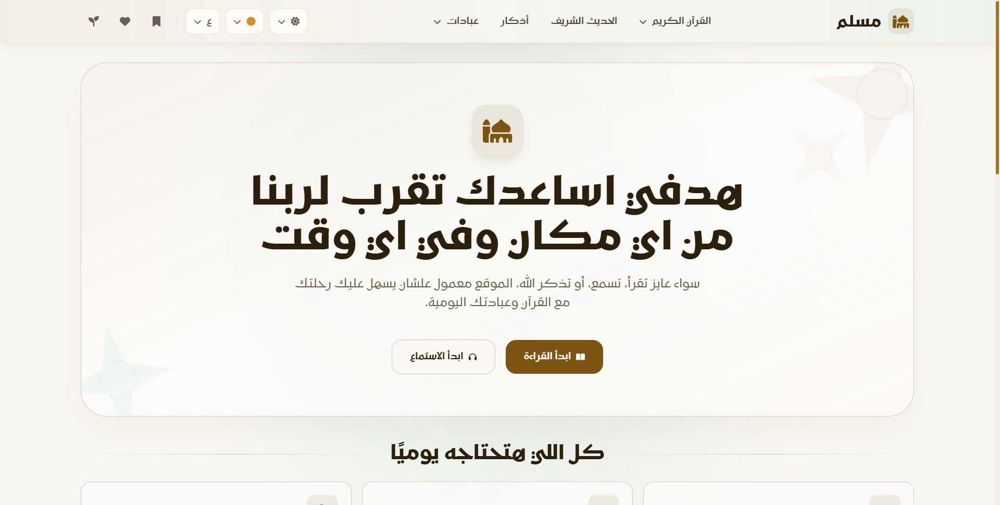

<div align="center">

<br />


<br />
<br />
<br />


<br />
<br />
<br />

**An open-source Islamic platform bringing together Quran, Hadith, Azkar, Prayer Times, and more - built as a Sadaqah Jariyah.**

<br />

[](https://muslim-one.vercel.app/)
[](https://nextjs.org/)
[](https://www.typescriptlang.org/)

<br />



<br />
<br />

</div>

<br />
<p align="center">— ✦ —</p>
<br />

## Table of Contents

- [About](#about-the-project)
- [Features](#features)
- [Tech Stack](#tech-stack)
- [Getting Started](#getting-started)
- [API](#api-documentation)
- [Contributing](#contributing)
- [License](#license)

<br />
<p align="center">— ✦ —</p>
<br />

## About The Project

**Muslim** is an open-source Islamic web platform designed to support Muslims in their daily worship. It is built as a **Sadaqah Jariyah** - a continuous act of charity.

The platform consolidates essential Islamic resources — the Holy Quran with audio and tafseer, authenticated Hadith collections, daily Azkar, prayer times, and more — into a single, beautifully designed experience.

<br />
<p align="center">— ✦ —</p>
<br />

## Features

<details>
<summary><strong>Holy Quran — Reading</strong></summary>
<br />

- Browse by **Surah** (1–114) or **Juz** (1–30)
- Authentic **Uthmani script** rendering
- **Tafseer** — Multiple Arabic commentary books
- **Saved Ayahs** — Bookmark verses to continue reading later
- **Favorite Surahs** for quick access
- **Copy & Share** Quranic verses with ease
- Smooth scrolling with ayah-level highlighting

</details>

<details>
<summary><strong>Holy Quran — Audio</strong></summary>
<br />

Choose from **14 world-renowned reciters**:

| Reciter | Arabic |
|---------|--------|
| Abdullah Basfar | عبد الله بصفر |
| Abdurrahman Al-Sudais | عبدالرحمن السديس |
| Abu Bakr Ash-Shaatree | أبو بكر الشاطري |
| Ahmed Al-Ajamy | أحمد العجمي |
| Mishary Alafasy | مشاري العفاسي |
| Hani Rifai | هاني الرفاعي |
| Mahmoud Al-Husary | محمود الحصري |
| Ali Al-Hudhaify | علي الحذيفي |
| Ibrahim Akhdar | إبراهيم الأخضر |
| Maher Al Muaiqly | ماهر المعيقلي |
| Muhammad Ayyoub | محمد أيوب |
| Muhammad Jibreel | محمد جبريل |
| Saood Ash-Shuraym | سعود الشريم |
| Mohamed El-Minshawi | محمد المنشاوي |

- High-quality streaming audio
- Full playback controls: play, pause, seek, skip
- Download audio for offline listening
- Favorite Surahs for quick recitation access

</details>

<details>
<summary><strong>Repeat (Hifz) Mode</strong></summary>
<br />

Memorize the Quran ayah by ayah with built-in repetition:

- Start repeating from any ayah via the ayah popover or audio player
- Set custom ayah ranges for focused memorization
- Adjustable repeat count per ayah (including infinite repeat)
- Visual repeat bar shows current ayah and repetition progress
- Cancel repeat mode anytime to continue normal playback

</details>

<details>
<summary><strong>Ayah to Image</strong></summary>
<br />

- Select any Ayah from favorites or manually
- Extend selection with adjacent verses
- Drag-and-drop cursors for precise verse selection
- 10 beautiful color palettes
- Download and share as an image

</details>

<details>
<summary><strong>Authentic Hadiths</strong></summary>
<br />

**8 major Hadith collections with 20,000+ hadiths:**

| Collection | Collection |
|-----------|-----------|
| Sahih Bukhari | Sunan an-Nasa'i |
| Sahih Muslim | Sunan Ibn Majah |
| Sunan Abu Dawud | Muwatta Malik |
| Sunan al-Tirmidhi | Musnad Ahmad |

- Browse by book and chapter
- Search in English or Arabic
- Bookmark favorite hadiths

</details>

<details>
<summary><strong>Daily Azkar & Duas</strong></summary>
<br />

**127+ authentic supplications across 8 categories:**

| Category | Count |
|----------|-------|
| Morning Azkar (أذكار الصباح) | 25 |
| Evening Azkar (أذكار المساء) | 25 |
| Sleep Azkar (أذكار النوم) | 10 |
| Wake Up Azkar (أذكار الاستيقاظ) | 3 |
| After Prayer Azkar (أذكار الصلاة) | 9 |
| Quranic Duas (أدعية قرآنية) | 26 |
| Prophets' Duas (أدعية الأنبياء) | 13 |

- Per-zikr repetition counter
- Save and manage favorite Azkar

</details>

<details>
<summary><strong>Prayer Times</strong></summary>
<br />

- Accurate, location-based prayer times
- Live countdown to the next prayer
- Hijri and Gregorian calendar display

</details>

<details>
<summary><strong>Sadaqah Jariyah Pages</strong></summary>
<br />

Create a personalized memorial page for a deceased loved one:

- Add their name
- Select Quranic chapters (Al-Fatihah, Yaseen, etc.)
- Include beautiful duas
- Generate a shareable link for family and friends to participate

</details>

<details>
<summary><strong>Personalization & UX</strong></summary>
<br />

- **Palette Selector** — select color to customize the UI
- **Dark / Light Mode** toggle
- **Arabic / English** language switcher
- **Favorites System** — Save Ayahs, Surahs, Hadiths, and Azkar
- **Share Functionality** — Share to social media or copy link

</details>

<br />
<p align="center">— ✦ —</p>
<br />

## At a Glance

| Feature | Value |
|--------|------|
| Reciters | **14** world-class |
| Hadiths | **20,000+** |
| Collections | **8 major books** |
| Azkar | **127+** |

<br />
<p align="center">— ✦ —</p>
<br />

## Tech Stack

| Layer | Stack |
|------|------|
| Framework | Next.js |
| Language | TypeScript |
| Styling | Tailwind CSS |
| Database | Supabase |

<br />
<p align="center">— ✦ —</p>
<br />

## Getting Started

### Prerequisites

Make sure you have the following installed:

- **Node.js** `>= 18.x`
- **npm** `>= 9.x`
- A **Supabase** account
- A **Hadith API** key from [hadithapi.com](https://hadithapi.com/)

### Installation

```bash
# 1. Fork the repository, then clone your fork
git clone https://github.com/YOUR_USERNAME/muslim.git
cd muslim

# 2. Install dependencies
npm install

# 3. Start the development server
npm run dev
```

Open [http://localhost:3000](http://localhost:3000) in your browser.

### Environment Variables

Create a `.env.local` file in the project root:

```env
# Supabase
SUPABASE_URL=your_supabase_project_url
SUPABASE_SERVICE_ROLE_KEY=your_supabase_service_role_key
SUPABASE_SADAQA_TABLE=sadaqa_garya_records

# Hadith API
HADITH_API_KEY=your_hadith_api_key
HADITH_API_BASE_URL=https://hadithapi.com/api
```

### Database Setup

This project uses **Supabase** for the Sadaqah Jariyah feature.

1. Create a new project at [supabase.com](https://supabase.com)
2. Navigate to the **SQL Editor**
3. Copy and run the schema from [`data/sadaqaGarya/sadaqa_supabase_schema.sql`](data/sadaqaGarya/sadaqa_supabase_schema.sql)

That's it, your database is ready.

<br />
<p align="center">— ✦ —</p>
<br />

## API Documentation

**External APIs Used:**

| API | Purpose |
|-----|---------|
| [AlQuran Cloud](https://alquran.cloud/api) | Quran text & audio |
| [Quran Tafseer API](http://api.quran-tafseer.com) | Arabic Tafseer |
| [Aladhan API](https://aladhan.com/prayer-times-api) | Prayer time calculation |
| [Hadith API](https://hadithapi.com/) | Hadith collections |
| [Azkar API](https://github.com/nawafalqari/azkar-api) | Daily Azkar & Duas |
| [Islamic Network CDN](https://cdn.islamic.network/) | Quran audio files |

And also a Full documentation for all APIs used in this project — including endpoints, authentication, parameters, and usage examples — is available in:

**[`API_Doc.md`](API_Doc.md)**

<br />
<p align="center">— ✦ —</p>
<br />

## Contributing

Contributions are **greatly appreciated** and are considered a Sadaqah Jariyah for you too, in sha' Allah.

To contribute:

1. **Fork** the repository
2. Create your feature branch: `git checkout -b feature/new-feature`
3. Commit your changes: `git commit -m 'feat: add new feature'`
4. Push to your branch: `git push origin feature/new-feature`
5. **Open a Pull Request**

<br />
<p align="center">— ✦ —</p>
<br />

## Bug Reports & Feature Requests

Found a bug or have a feature idea? Please [open an issue](../../issues/new/choose)

<br />
<p align="center">— ✦ —</p>
<br />

## License

This project is **open source** and free to use, modify, and distribute.

<br />
<p align="center">— ✦ —</p>
<br />

If you find this project valuable, please consider:
- ⭐ **Starring** the repository
- 🔀 **Sharing** it with others
- 🤝 **Contributing** improvements

<div align="center">
</div>
